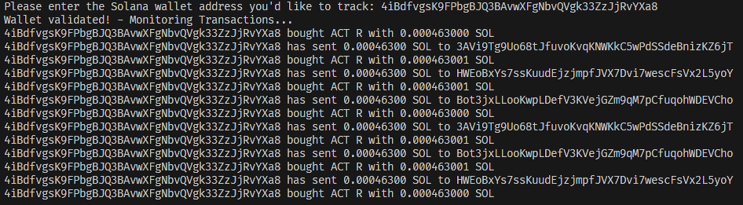

# Soltracker


## How to run

- Clone the repository

```bash
git clone https://github.com/kzquandary/technical-test-solana.git
```

- Install dependencies

```bash
go mod tidy
```

- Add API Key to config.go

```go
rpcURL := "https://mainnet.helius-rpc.com/?api-key=YOUR_API_KEY"
wssURL := "wss://mainnet.helius-rpc.com/?api-key=YOUR_API_KEY"
```

- Run the program

```bash
go run main.go
```


## Screenshot




